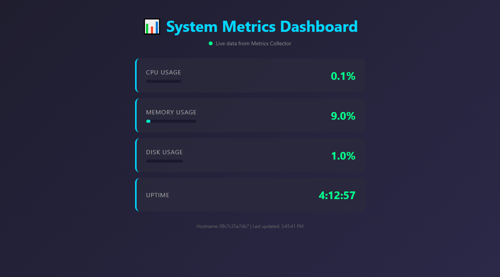
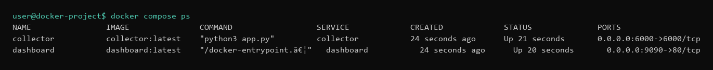
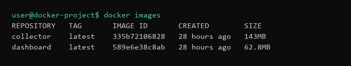
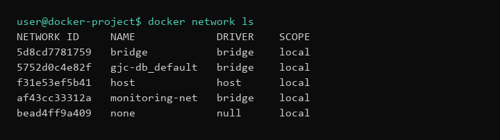
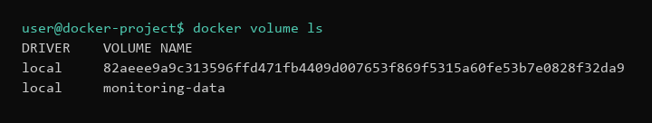

# Submission — Docker Monitoring Stack

This is a multi-container monitoring app. The **dashboard** (NGINX) shows live system metrics in the browser, and the **collector** (Flask) serves those metrics over an API. Both run together with Docker Compose on a shared network and volume.

I created and developed this project on a **Linux** PC (lab server). The screenshots below were taken on a **Windows** PC (Docker Desktop and local browser).

---

## Project structure

```
docker-project/
├── compose.yaml
├── dashboard/
│   ├── Dockerfile
│   └── index.html
└── collector/
    ├── Dockerfile
    └── application files
```

---

## How to run

```bash
cd docker-project
docker compose up -d
```

Open the dashboard at `http://localhost:9090` (or `http://<server-ip>:9090` on the Linux lab machine).

Stop everything with:

```bash
docker compose down
```

---

## Screenshots

### Working dashboard

Live CPU, memory, disk, and uptime in the browser.



### `docker compose ps`

Both `dashboard` and `collector` containers are running.



### Docker images

Built `dashboard` and `collector` images are listed.



### Docker network

Custom `monitoring-net` network exists.



### Docker volume

Persistent `monitoring-data` volume exists.



---

## Short Questions

**What is the difference between a Docker image and a container?**
An image is the blueprint (for example `dashboard:latest`). A container is a running — or stopped — instance of that image. I build the image once, then I can start one or more containers from it.

**What does 9090:80 mean?**
It’s a port mapping: host port `9090` maps to container port `80`. In my project, NGINX listens on 80 inside the dashboard container, so I open the app at `http://localhost:9090`.

**Why do containers need a Docker network?**
So they can talk to each other on an isolated network using service names instead of hard-coded IPs. My dashboard reaches the collector at `collector:6000` through `monitoring-net`.

**Why do we use Docker volumes?**
Volumes keep data outside the container’s filesystem, so it survives restarts and rebuilds. I use `monitoring-data` mounted at `/data` on the collector for that.

**What problem does Docker Compose solve?**
It lets me run a multi-container app with one file and one command. Instead of typing long `docker run` commands for ports, networks, volumes, and restart policies, I use `compose.yaml` and `docker compose up -d`.

---

## Bonus — Restart Policy

Both services in `compose.yaml` use:

```yaml
restart: unless-stopped
```

That means Docker restarts the containers if they crash or if the machine/Docker daemon reboots. They won’t restart only if I stop them myself (`docker compose stop` / `docker compose down`).

---

## Troubleshooting (Task 5)

### Issue 1: Dashboard could not reach the Metrics Collector

**What caused the problem?**
Chrome blocked port 6000 (`ERR_UNSAFE_PORT`), so the browser could not call the collector directly.

**Which command helped you find it?**
Browser DevTools (F12 → Console) showed `net::ERR_UNSAFE_PORT` on the request to port 6000.

**How did you fix it?**
I set up NGINX as a reverse proxy on the dashboard so the browser only talks to port 9090 (`/api/status`), and NGINX forwards to `collector:6000` on the Docker network.

### Issue 2: Site unreachable after session restart

**What caused the problem?**
My server IP changed over DHCP (from `192.168.1.8` to `192.168.1.9`), so I was still opening the old URL.

**Which command helped you find it?**
`hostname -I` (after confirming the app was fine locally with `curl -I http://localhost:9090` and `ss -tulnp | grep 9090`).

**How did you fix it?**
I opened the dashboard with the new IP: `http://192.168.1.9:9090`.
